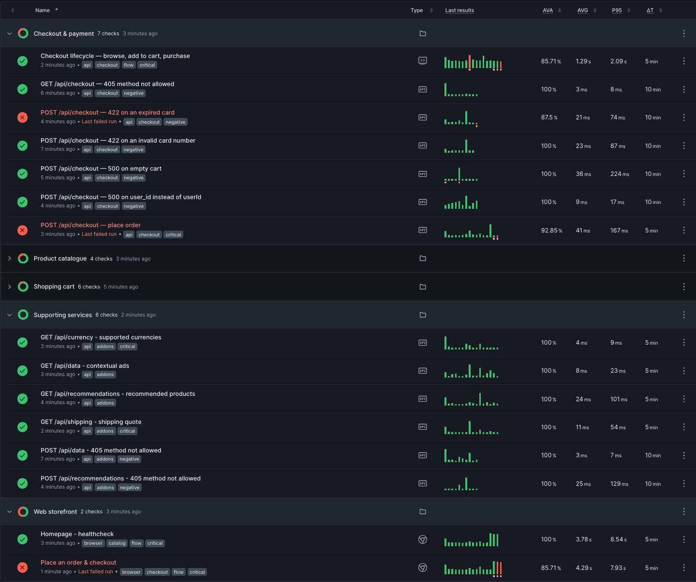

# Checkly Astronomy

Monitoring project for the [OpenTelemetry Astronomy Shop](https://opentelemetry.io/docs/demo/)
demo, running locally under Docker. Covers the public APIs, and UI layer for full synthetic coverage, 
fast issue detection and revenue assurance using Checkly, complementing the already well oiled Observability stack



## Quick Start

The otel demo stack and your checkly private location agent must be running first (see relevant section)

```bash
nvm use                      # Node 22 (checkly CLI requires >=22.13)
npm install
npx checkly login
npx tsc --noEmit             # local gate: typecheck every construct and spec
npx checkly test --verbose   # dry-run all checks on the private location
npx checkly deploy           # deploy to Checkly
```

## What Gets Monitored

### Catalog

| Check | Type | Negative | Frequency | What it validates |
|-------|------|----------|-----------|-------------------|
| Product catalogue loads | API | — | 5m | `GET /api/products` returns the catalogue, known IDs present |
| Single product loads | API | — | 5m | `GET /api/products/{id}` returns the seeded product |
| Unknown product is handled | API | Yes | 10m | Unknown ID returns **500, not 404** |
| Catalogue rejects bad methods | API | Yes | 10m | `POST` rejected with 405 |

### Cart

| Check | Type | Negative | Frequency | What it validates |
|-------|------|----------|-----------|-------------------|
| Cart contents load | API | — | 5m | `GET /api/cart` returns a hydrated cart (seeded via setup script) |
| Item added to cart | API | — | 5m | `POST /api/cart` adds a line |
| Cart emptied | API | — | 5m | `DELETE /api/cart` returns 204 |
| Wrong identity returns empty cart | API | Yes | 10m | `userId` instead of `sessionId` silently returns 200 + empty cart |
| Malformed cart write rejected | API | Yes | 10m | Body without `userId`/`item` returns 500 |
| Cart lifecycle | MultiStep | — | 5m | cart empty → add to cart → cart not empty → delete → empty |

### Checkout

| Check | Type | Negative | Frequency | What it validates |
|-------|------|----------|-----------|-------------------|
| Order placed successfully | API | — | 5m | Order placed, 7-service fan-out |
| Payment declined — invalid card | API | Yes | 10m | Invalid card returns **422 `PAYMENT_FAILED`** |
| Payment declined — expired card | API | Yes | 10m | Expired card returns **422 `PAYMENT_FAILED`** |
| Order with empty cart fails | API | Yes | 10m | Empty cart returns 500 |
| Order with bad identity fails | API | Yes | 10m | `user_id` instead of `userId` returns 500 |
| Checkout rejects bad methods | API | Yes | 10m | `GET` rejected with 405 |
| Purchase flow | MultiStep | — | 5m | browse → add to cart → purchase → cart emptied |

### Supporting services

| Check | Type | Negative | Frequency | What it validates |
|-------|------|----------|-----------|-------------------|
| Currency list available | API | — | 5m | `GET /api/currency` |
| Shipping quote returned | API | — | 5m | `GET /api/shipping` |
| Recommendations returned | API | — | 5m | `GET /api/recommendations` |
| Contextual ads returned | API | — | 5m | `GET /api/data` returns contextual ads |
| Recommendations rejects bad methods | API | Yes | 10m | `POST` rejected with 405 |
| Ads rejects bad methods | API | Yes | 10m | `POST` rejected with 405 |

### UI journeys

| Check | Type | Negative | Frequency | What it validates                                    |
|-------|------|----------|-----------|------------------------------------------------------|
| Homepage health | Browser | — | 5m | Store homepage renders the product list              |
| Full purchase journey | Browser | — | 5m | Homepage -> product -> cart -> order -> confirmation |

## Checkly private location agent

This project targets a **Private Location** instead, with a Checkly Agent container on the
demo's Docker network. From inside that container the app is `frontend-proxy:8080`.

```bash
cd private-location && docker compose up -d      # requires API_KEY in ../.env
```

## Base URL

One environment variable is used for every API checks and UI checks:

```ts
// checkly.fixtures.ts
export const BASE_URL_DEV = process.env.BASE_URL_DEV ?? 'http://frontend-proxy:8080'
```

Don't hesitate to change it if the demo stack is running publicly in production environment

## Project Structure

```
├── checkly.config.ts                 # project config (runtime 2026.04, private location)
├── checkly.fixtures.ts               # all test data, shared by checks, specs and setup scripts
├── checkly.groups.ts                 # the five business check groups
├── playwright.config.ts              
├── tsconfig.json                     
├── .nvmrc                            
├── api/                              # the api checks, public endpoints surface
│   ├── catalog/__checks__/
│   ├── cart/__checks__/              
│   ├── checkout/__checks__/          
│   └── addons/__checks__/
├── e2e-journeys/                     # synthetic real user journeys on the store UI
│   └── catalog/__checks__/
├── .github/workflows/                # manual github actions: validate, test and deploy monitors
├── private-location/                 # Checkly Agent container
├── assets/                           
└── docs/                             # Generated documentation + OpenAPI spec from the otel demo project
```

## After running the otel demo stack

| What | Where |
|---|---|
| App | http://localhost:8080 |
| Grafana | http://localhost:8080/grafana/ |
| Jaeger | http://localhost:8080/jaeger/ui |
| Load generator | http://localhost:8080/loadgen/ |

## Documentation

All docs describe the **otel demo stack**, generated at the time of this project creation. 

[`docs/README.md`](docs/README.md).

| Doc | Covers |
|---|---|
| [`01-stack-architecture.md`](docs/01-stack-architecture.md) | 31 services, ports, dependency graph, flagd fault injection |
| [`02-telemetry-pipeline.md`](docs/02-telemetry-pipeline.md) | Collector, the three backends, known failure modes |
| [`03-public-endpoints.md`](docs/03-public-endpoints.md) | The synthetic-test surface, contracts, measured baselines |
| [`04-agent-mcp-chatbot.md`](docs/04-agent-mcp-chatbot.md) | Agent/MCP/chatbot, `MCP_ENABLED`, VCR-replay LLM |
| [`openapi/`](docs/openapi/) | Reverse-engineered OpenAPI spec |
